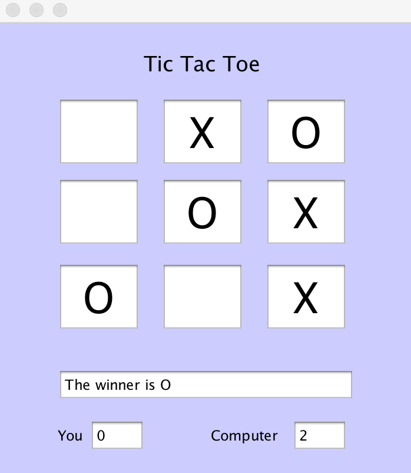

# A Perfect Tic Tac Toe - Minimax

This game initially started as a school project, but the implementation of the Minimax algorithm to create an AI that will always win or draw is independent. It also can be played multiplayer. X always starts, and if played against the AI, the user is always X.

This project was made in Java.

